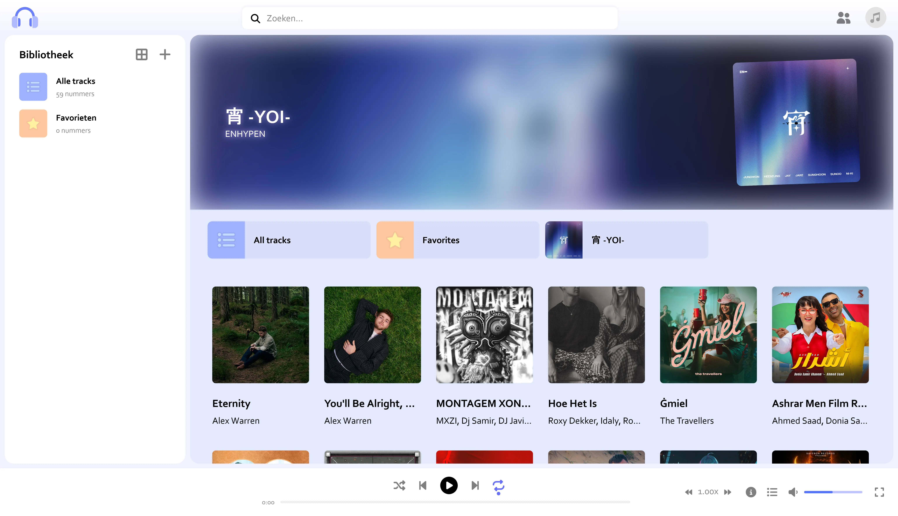
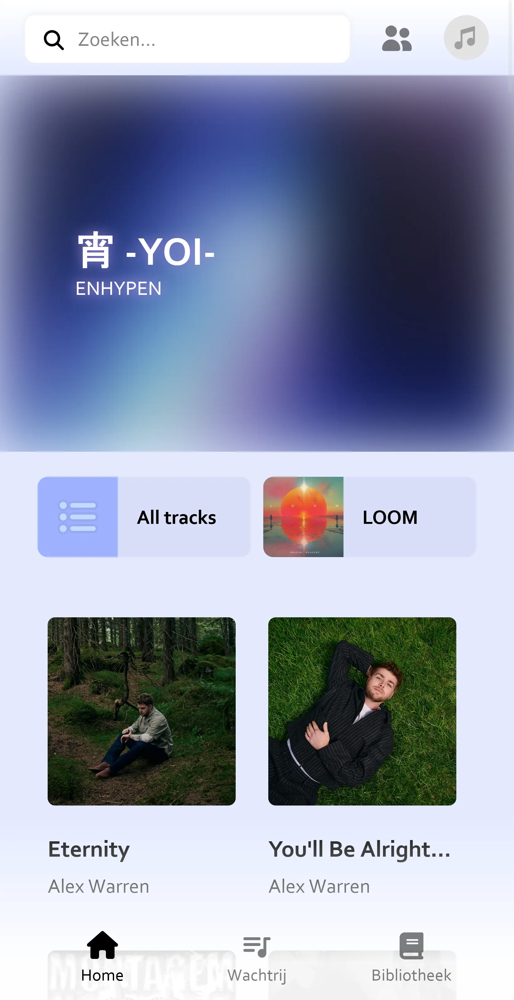
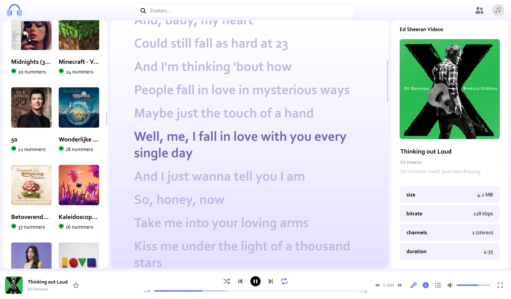
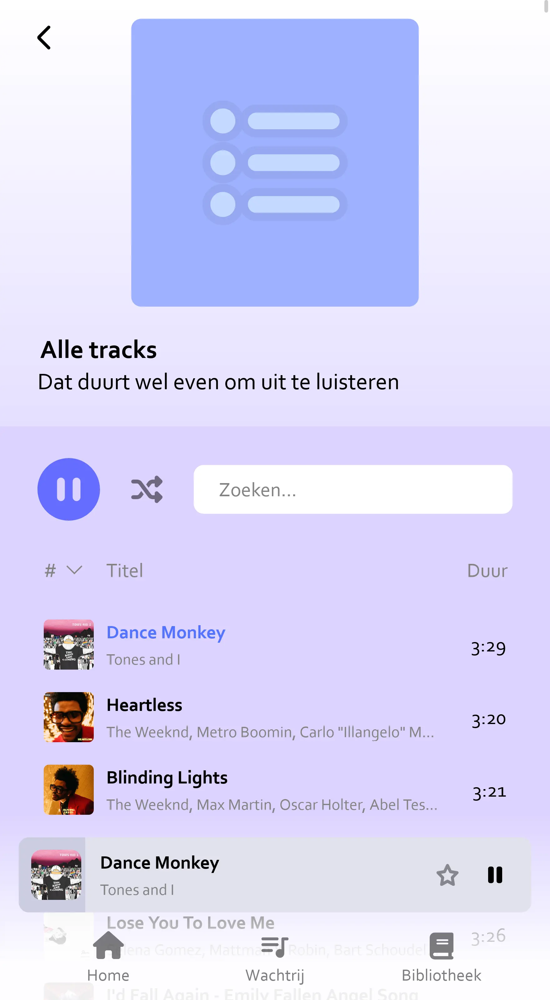
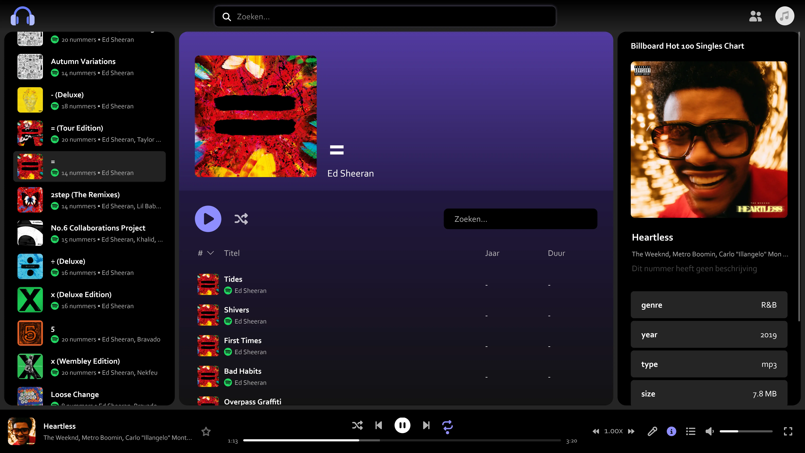
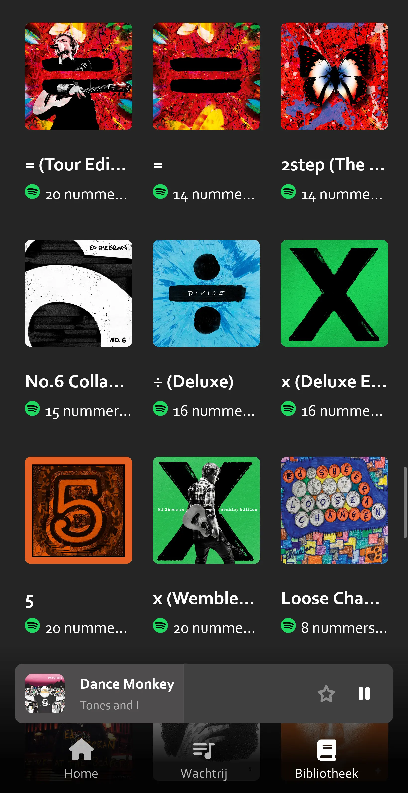

# nottify

 

> [!NOTE]  
> nottify is still in beta phase. Some parts of the application are not translated yet. There might also be some small issues and weird behaviour. More features will be added later.

 

**Have you ever wanted to host your own music library?** Here's your chance! Upload and manage your own music files with nottify. With it's ease of use and a familiar and intuitive layout, it's one of the most simple ways to take your music back in own hand. Not bought enough music to fill your own collection yet? Connect your Spotify Premium account to also access your Spotify collection.

nottify is a PHP based web application. It is aimed at self-hosters. **You can just download a ZIP of the repo, unpack it and yeet it somewhere on your PHP-server and it will work immediately.** No setup required. No database. Just you and your music.

✅ Simple install with complete control over the application

✅ Supports mobile and computer layout

✅ Manage all your music in one place

✅ Keep using all features you're used to, like synced lyrics and audio normalization

✅ Still access your music collection on Spotify, 

✅ With optional implementation of the [Musicbrainz](https://musicbrainz.org/doc/MusicBrainz_API), [LRCLIB](https://lrclib.net/docs), [Genius](https://docs.genius.com), [radio-browser](https://api.radio-browser.info/), [Last.fm](https://www.last.fm/api) and [Spotify](https://developer.spotify.com) API

 

# a few tips
Once you've installed nottify you can either call it a day or customize your experience further. **If you want to do some customizing, then here's a few tips:**

⚙️ Look in the config.php file for settings to modify.

🔑 Enter API client details for Spotify, Genius and/or Last.fm in config.php. It's free and unlocks multiple features, such as Spotify streaming, more artist data and viewing what your friends are listening to.

📜 Missing your language? nottify supports English and Dutch by default, but you can add languages by duplicating `locales/en.json`, modifying it, and saving it under `locales/[countrycode].json`.

🗑️ The cache folder is as the name indicates a cache folder. You can safely remove it whenever if you want to.

📂 The library folder contains your music. You can safely replace audio, image and lyric files (you'll need to reset the cache though). Added files will not be recognised, deleted files will create ghost songs/images/lyrics in your library until you delete them there too, so please don't do that. Also, don't touch the JSON files unless you know what you're doing.

 

# thanks
nottify uses a few libraries and APIs. Thanks to everyone who worked on them!

Libraries
- [music-metadata](https://github.com/Borewit/music-metadata) by Borewit (licenced MIT)
- [JSZip](https://github.com/Stuk/jszip) by Stuk (licenced MIT or GPLv3)

APIs
- [LRCLIB](https://github.com/tranxuanthang/lrclib) by tranxuanthang (licenced MIT)
- [radio-browser](https://github.com/segler-alex/radiobrowser) by segler-alex (licenced AGPL-3.0)
- [Musicbrainz](https://github.com/metabrainz/musicbrainz-server) by metabrainz (licenced GPLv2+ and a little bit BSD 2-clause)
- [Last.fm](https://github.com/lastfm/) by lastfm (some clients are open source under GPLv3)
- [Spotify](https://github.com/spotify/) by spotify (not open source)
- [Genius](https://github.com/Genius/) by Genius (not open source)

 

# screenshots

[View more](screenshots/)
